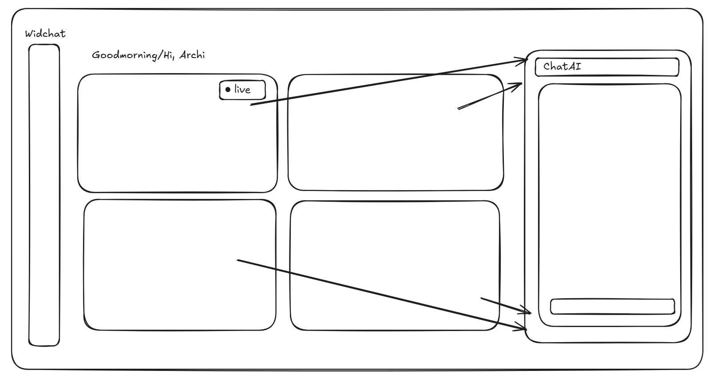

# Manager-Facing Dashboard & UI Selection (Design Decisions)

This document explains the key design decisions behind the WidChat AI assistant panel based on the enterprise dashboard design guidelines.

### A. How does the user know which widget is currently active?
- **High-Contrast Highlighting**: The active widget scales up (`scale: 1.02`), shifts slightly upward (`y: -4`), and receives a high-contrast border matching its theme color (e.g., `#E5C13C` for Learning Progress).
- **Pulsing Active Badge**: A floating dark badge on the top right containing a pulsing green dot and the text "Active" is displayed, giving direct visual feedback.
- **Background Dimming**: The remaining data widgets dynamically decrease opacity to `0.75` (or lower on hover states), pulling the user's focal focus to the selected card.

### B. How does context transfer from the selected widget into the chat?
- **Selection Interaction (The Flying Context Chip)**: When a widget is clicked, a floating capsule representing the widget's category, icon, and label is spawned directly at the coordinates of the clicked card. Using Framer Motion, it flies dynamically along a spring cubic bezier path across the viewport and lands directly on the right panel's chat target.
- **Step-by-Step Initial Synchronizer**: Once the chip lands, the assistant transitions through detailed states (`syncing` -> `thinking` -> `generating` -> `analyzed`) with a premium gradient loading ring to indicate that data context is fully loaded.
- **Persistent Header Details**: The top of the active AI panel displays a colored capsule tag representing the selected widget, reminding the manager of the active context.

### C. How does the AI response render — plain text, a small chart, or a summary card?
- **Structured Summary Cards**: Instead of plain text, the AI renders a premium custom-styled card representing the dataset.
- **Embedded Sparkline Charts**: 
  - *Learning Progress*: Displays completion metrics, trends, and a custom SVG sparkline weekly trend.
  - *Course Activity*: Shows active learners, average session lengths, and a peak hourly activity line.
  - *Skill Development*: Displays certifications and gap priority bar charts.
  - *Employee Engagement*: Displays engagement ratings and quarterly retention streak charts.
- **Embedded Action Items**: Includes actionable buttons (e.g. *Reward Streaks*, *Suggest Mentors*, *Approve L&D Budget*) to bridge the gap between analysis and operational execution.

So, before the design did a mockup on excaidraw on my thoughts and vision related to the ui/design. Then iterated over the niche and built it more on it. 
